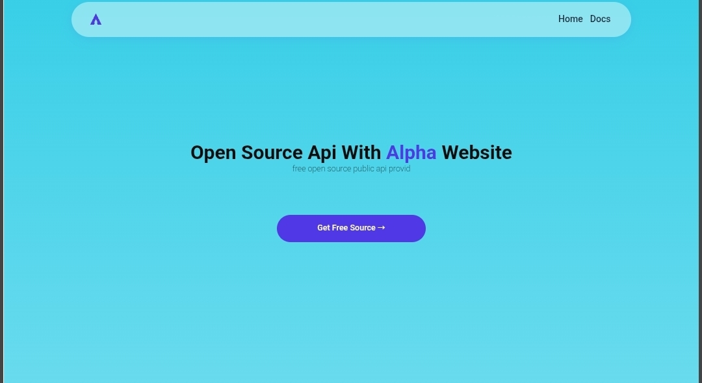

# 🚀 Alpha Open Source API & Scrap



> Free open source public APIs and web scraping tools built with Node.js, Express, and Cheerio. No rate limits, no login required! 🌐✨

---

## 🛠️ Tech Stack & Dependencies

- **Runtime:** Node.js (CommonJS)
- **Framework:** Express (^5.2.1)
- **Web Scraping / Parsing:** Cheerio (^1.2.0), Axios, Cloudscraper
- **Cloudflare Bypass:** `@mrhansamala/cf-bypass`
- **Template Engine:** HBS (Handlebars)
- **Development:** Nodemon

---

## 🚀 Quick Start / Installation

1. **Clone the repository:**
```bash
git clone https://github.com/Ruwantha-OFFICIAL/Alpha.git
cd alpha
```
2. **Install dependencies:**

```bash
npm install
```
3. **Run the project:**
- For development (with Nodemon):

   ```bash
   npm run dev
   ```

- For production:
  
  ```bash
  npm run start
  ```
## 👤 Author

* **Lasith Ruwantha**
* **GitHub:** [@Ruwantha-OFFICIAL](https://github.com/Ruwantha-OFFICIAL)

## 📄 License

This project is licensed under the **MIT License**.
